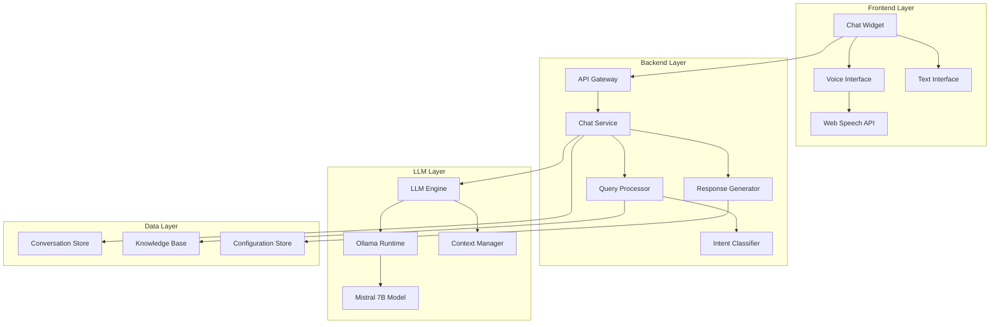
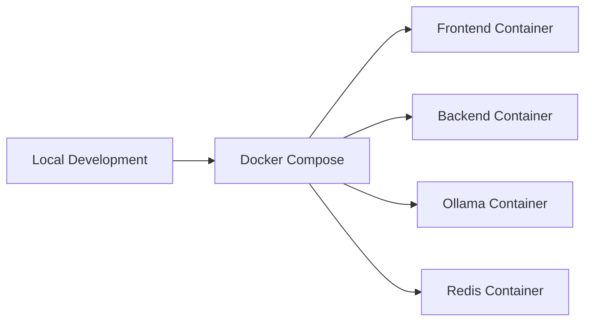

# Design Document

## Overview

The LLM Chatbot system is a web-based conversational AI platform that integrates open source Large Language Models to provide text and voice interactions. The system follows a microservices architecture with a React-based frontend, Node.js backend, and containerized LLM service. The design prioritizes cost-effectiveness, easy deployment, and seamless website integration while maintaining security and performance standards.

## Architecture

The system uses a three-tier architecture:



**Key Architectural Decisions:**
- **Containerized LLM**: Using Ollama for model management and inference
- **Stateless API**: RESTful design with conversation context managed separately
- **Browser-native voice**: Leveraging Web Speech API to avoid additional costs
- **Embeddable widget**: Self-contained component for easy website integration

## Components and Interfaces

### Frontend Components

**Chat Widget (`ChatWidget.tsx`)**
- Embeddable React component with minimal dependencies
- Responsive design that adapts to different screen sizes
- Configurable styling and branding options
- Interface: Props for configuration, callbacks for events

**Voice Interface (`VoiceInterface.tsx`)**
- Manages speech recognition and synthesis
- Visual feedback for voice states (listening, processing, speaking)
- Fallback to text input when voice fails
- Interface: `startListening()`, `stopListening()`, `speak(text)`

**Text Interface (`TextInterface.tsx`)**
- Message input with validation and formatting
- Conversation history display with timestamps
- Typing indicators and message status
- Interface: `sendMessage(text)`, `displayMessage(message)`

### Backend Services

**API Gateway (`server.js`)**
- Express.js server with CORS and security middleware
- Rate limiting and request validation
- Health checks and monitoring endpoints
- Interface: REST endpoints for chat operations

**Chat Service (`chatService.js`)**
- Orchestrates conversation flow
- Manages session state and context
- Handles error recovery and fallbacks
- Interface: `processMessage(sessionId, message)`, `getHistory(sessionId)`

**Query Processor (`queryProcessor.js`)**
- Analyzes user intent and message type
- Routes queries to appropriate handlers (FAQ, troubleshooting, etc.)
- Extracts entities and context from messages
- Interface: `classifyIntent(message)`, `extractEntities(message)`

**Response Generator (`responseGenerator.js`)**
- Formats LLM outputs for user consumption
- Adds contextual information and links
- Handles response personalization
- Interface: `formatResponse(llmOutput, context)`, `addMetadata(response)`

### LLM Integration

**LLM Engine (`llmEngine.js`)**
- Interfaces with Ollama runtime
- Manages model loading and inference
- Handles prompt engineering and context injection
- Interface: `generateResponse(prompt, context)`, `loadModel(modelName)`

**Context Manager (`contextManager.js`)**
- Maintains conversation history and context
- Implements context window management
- Handles memory optimization
- Interface: `updateContext(sessionId, message)`, `getContext(sessionId)`

## Data Models

### Message Model
```typescript
interface Message {
  id: string;
  sessionId: string;
  content: string;
  type: 'user' | 'assistant' | 'system';
  timestamp: Date;
  metadata?: {
    intent?: string;
    confidence?: number;
    processingTime?: number;
  };
}
```

### Session Model
```typescript
interface Session {
  id: string;
  userId?: string;
  startTime: Date;
  lastActivity: Date;
  context: ConversationContext;
  configuration: SessionConfig;
}
```

### Configuration Model
```typescript
interface ChatbotConfig {
  modelName: string;
  maxContextLength: number;
  responseTimeout: number;
  voiceEnabled: boolean;
  knowledgeBase: string[];
  styling: WidgetStyling;
}
```

### Knowledge Base Model
```typescript
interface KnowledgeEntry {
  id: string;
  category: 'faq' | 'troubleshooting' | 'product' | 'onboarding';
  question: string;
  answer: string;
  keywords: string[];
  lastUpdated: Date;
}
```

## Correctness Properties

*A property is a characteristic or behavior that should hold true across all valid executions of a system-essentially, a formal statement about what the system should do. Properties serve as the bridge between human-readable specifications and machine-verifiable correctness guarantees.*

### Core Interaction Properties

**Property 1: Response Generation Timeliness**
*For any* valid user message, the system should generate and return a response within 5 seconds
**Validates: Requirements 1.1**

**Property 2: Empty Message Rejection**
*For any* string composed entirely of whitespace or empty content, the system should reject the message and maintain conversation state unchanged
**Validates: Requirements 1.2**

**Property 3: Conversation History Preservation**
*For any* conversation with more than 50 messages, the system should maintain complete message history while keeping memory usage within acceptable bounds
**Validates: Requirements 1.4**

**Property 4: Interface Configuration Consistency**
*For any* user preference setting, the system should display only the appropriate interface elements (text-only when voice is disabled, both when voice is enabled)
**Validates: Requirements 1.5, 2.5**

### Voice Interface Properties

**Property 5: Speech-to-Text Conversion**
*For any* detected speech input, the system should convert it to text and display the transcription to the user
**Validates: Requirements 2.2**

**Property 6: Text-to-Speech Conversion**
*For any* chatbot response when voice is enabled, the system should convert the text to speech and play it automatically
**Validates: Requirements 2.3**

**Property 7: Voice Error Recovery**
*For any* speech recognition failure or unclear result, the system should provide appropriate error handling and alternative input options
**Validates: Requirements 2.4**

### Knowledge Processing Properties

**Property 8: FAQ Intent Classification**
*For any* user question that matches FAQ content, the system should correctly identify it as an FAQ query and route it to the knowledge base
**Validates: Requirements 3.1**

**Property 9: FAQ Response Accuracy**
*For any* FAQ query, the system should provide responses that accurately reflect the predefined knowledge base content
**Validates: Requirements 3.2**

**Property 10: Intent Recognition Consistency**
*For any* set of question variations with the same intent, the system should provide consistent responses
**Validates: Requirements 3.3**

**Property 11: Out-of-Scope Handling**
*For any* question that cannot be answered from available knowledge, the system should acknowledge limitations and suggest alternatives
**Validates: Requirements 3.4**

**Property 12: Response Metadata Inclusion**
*For any* FAQ response where relevant links or next steps are available, the system should include them in the response
**Validates: Requirements 3.5**

### Onboarding Flow Properties

**Property 13: Onboarding Step Progression**
*For any* onboarding request, the system should provide structured step-by-step guidance with clear progression
**Validates: Requirements 4.1, 4.2**

**Property 14: Step Completion Acknowledgment**
*For any* completed onboarding step, the system should acknowledge completion and proceed to the next step
**Validates: Requirements 4.3**

**Property 15: Onboarding Error Assistance**
*For any* user difficulty during onboarding, the system should offer alternative explanations or escalation options
**Validates: Requirements 4.4**

### Troubleshooting Properties

**Property 16: Problem Analysis and Solution Ordering**
*For any* technical problem description, the system should analyze the issue and suggest solutions ordered by likelihood and simplicity
**Validates: Requirements 5.1, 5.2**

**Property 17: Alternative Solution Provision**
*For any* failed troubleshooting attempt, the system should offer alternative approaches or escalation options
**Validates: Requirements 5.3**

**Property 18: Escalation Recommendation**
*For any* issue that exceeds system capabilities, the system should recommend human support with relevant context
**Validates: Requirements 5.4**

### Product Information Properties

**Property 19: Documentation-Based Responses**
*For any* product feature question, the system should generate responses based on current product documentation
**Validates: Requirements 6.1**

**Property 20: Complete Product Information**
*For any* product information request, the system should include all relevant available details (pricing, availability, specifications)
**Validates: Requirements 6.2**

**Property 21: Information Freshness**
*For any* updated product information, subsequent responses should reflect the changes
**Validates: Requirements 6.3**

**Property 22: Unavailable Information Handling**
*For any* request for unavailable product information, the system should acknowledge limitations and suggest alternatives
**Validates: Requirements 6.4**

### System Performance Properties

**Property 23: Resource Efficiency**
*For any* production deployment, the system should operate within the resource limits of cost-effective hosting options
**Validates: Requirements 7.2**

**Property 24: Graceful Degradation**
*For any* resource constraint scenario, the system should maintain core functionality without degradation
**Validates: Requirements 7.4**

**Property 25: Usage Monitoring**
*For any* system operation, resource usage and cost metrics should be collected and reported accurately
**Validates: Requirements 7.5**

### Integration Properties

**Property 26: Web Technology Compatibility**
*For any* standard web environment, the chatbot widget should integrate successfully without conflicts
**Validates: Requirements 8.1, 8.3**

**Property 27: Layout Adaptability**
*For any* website layout and styling requirements, the chat widget should adapt appropriately
**Validates: Requirements 8.2**

**Property 28: Integration Error Handling**
*For any* integration issue, the system should provide clear error messages and fallback options
**Validates: Requirements 8.4**

**Property 29: Configuration Flexibility**
*For any* customization requirement, the system should support appropriate configuration options for branding and behavior
**Validates: Requirements 8.5**

### Open Source LLM Properties

**Property 30: API Independence**
*For any* response generation, the system should produce coherent text without requiring proprietary APIs
**Validates: Requirements 9.2**

### Security Properties

**Property 31: Data Retention Compliance**
*For any* stored conversation data, the system should enforce appropriate retention policies
**Validates: Requirements 10.2**

**Property 32: Sensitive Data Protection**
*For any* detected sensitive information, the system should handle it appropriately without unnecessary logging or storage
**Validates: Requirements 10.4**

## Error Handling

The system implements comprehensive error handling across all components:

### Frontend Error Handling
- **Network failures**: Automatic retry with exponential backoff
- **Voice API failures**: Graceful fallback to text input
- **Widget loading errors**: Display fallback UI with basic functionality
- **Browser compatibility**: Progressive enhancement with feature detection

### Backend Error Handling
- **LLM service failures**: Fallback to predefined responses or alternative models
- **Database connection issues**: Temporary in-memory storage with persistence retry
- **Rate limiting**: Queue management with user feedback
- **Timeout handling**: Partial response delivery with continuation options

### LLM Integration Error Handling
- **Model loading failures**: Automatic fallback to lighter models
- **Context overflow**: Intelligent context truncation with summary preservation
- **Generation timeouts**: Partial response with completion options
- **Resource exhaustion**: Request queuing with priority management

## Testing Strategy

The testing approach combines unit testing and property-based testing to ensure comprehensive coverage:

### Unit Testing Framework
- **Frontend**: Jest with React Testing Library for component testing
- **Backend**: Jest with Supertest for API endpoint testing
- **Integration**: Playwright for end-to-end user journey testing

### Property-Based Testing Framework
- **Library**: fast-check for JavaScript/TypeScript property-based testing
- **Configuration**: Minimum 100 iterations per property test
- **Coverage**: Each correctness property implemented as a single property-based test
- **Tagging**: Each test tagged with format: `**Feature: llm-chatbot, Property {number}: {property_text}**`

### Testing Approach
- **Unit tests**: Verify specific examples, edge cases, and error conditions
- **Property tests**: Verify universal properties across all valid inputs
- **Integration tests**: Validate component interactions and user workflows
- **Performance tests**: Ensure response times and resource usage meet requirements

### Test Data Management
- **Synthetic data**: Generated test conversations and user inputs
- **Knowledge base fixtures**: Predefined FAQ and product information for testing
- **Mock services**: LLM response simulation for consistent testing
- **Browser automation**: Automated voice interface testing with synthetic audio

## Deployment Architecture

### Development Environment


### Production Deployment Options

**Option 1: Free Tier Deployment**
- **Frontend**: Vercel/Netlify static hosting
- **Backend**: Railway/Render free tier
- **LLM**: Ollama on free tier VPS (limited performance)
- **Database**: Redis Cloud free tier or SQLite

**Option 2: Low-Cost Deployment**
- **All-in-one**: DigitalOcean Droplet ($6/month)
- **Container orchestration**: Docker Compose
- **Load balancing**: Nginx reverse proxy
- **Monitoring**: Built-in metrics dashboard

**Option 3: Scalable Cloud Deployment**
- **Frontend**: CDN distribution (Cloudflare)
- **Backend**: Container service (Google Cloud Run)
- **LLM**: Dedicated compute instance with GPU
- **Database**: Managed Redis/PostgreSQL

### Deployment Pipeline
1. **Build**: Docker multi-stage builds for optimization
2. **Test**: Automated testing in CI/CD pipeline
3. **Deploy**: Blue-green deployment with health checks
4. **Monitor**: Automated rollback on failure detection

### Cost Optimization Strategies
- **Model quantization**: Use 4-bit quantized models for reduced memory usage
- **Caching**: Aggressive response caching for common queries
- **Auto-scaling**: Scale down during low usage periods
- **Resource monitoring**: Automated alerts for cost thresholds