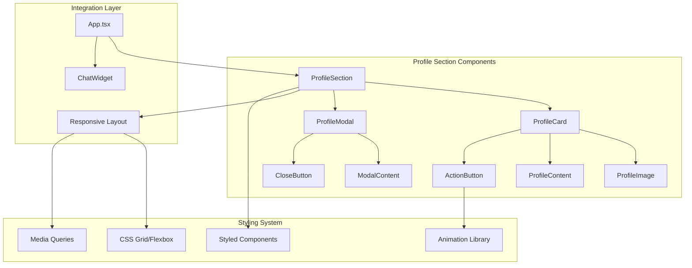

# Design Document

## Overview

The Personal Profile Section is a modern, responsive component that will be integrated into the top 25% of the chatbot application page. The design follows contemporary web design principles with a focus on professional presentation, visual hierarchy, and seamless integration with the existing chatbot interface. The component features a card-based layout with gradient backgrounds, professional typography, and interactive elements that enhance user engagement.

## Architecture

The profile section follows a component-based architecture that integrates with the existing React frontend:



**Key Design Decisions:**
- **Component-based architecture**: Modular React components for maintainability
- **Styled Components**: CSS-in-JS for dynamic styling and theming
- **CSS Grid/Flexbox**: Modern layout techniques for responsive design
- **Framer Motion**: Smooth animations and transitions
- **Modal pattern**: Overlay for extended information without navigation

## Components and Interfaces

### ProfileSection Component

**Primary Container (`ProfileSection.tsx`)**
- Main wrapper component that manages layout and positioning
- Handles responsive behavior and viewport calculations
- Manages modal state and user interactions
- Interface: `ProfileSectionProps` with configuration options

```typescript
interface ProfileSectionProps {
  profile: ProfileData;
  styling?: ProfileStyling;
  onModalOpen?: () => void;
  onModalClose?: () => void;
}
```

### ProfileCard Component

**Content Container (`ProfileCard.tsx`)**
- Card-based layout with modern styling
- Gradient backgrounds and shadow effects
- Responsive grid layout for content organization
- Interface: `ProfileCardProps` for content and styling

```typescript
interface ProfileCardProps {
  profile: ProfileData;
  styling: ProfileStyling;
  onActionClick: () => void;
}
```

### ProfileImage Component

**Image Display (`ProfileImage.tsx`)**
- Optimized image loading with lazy loading
- Responsive image sizing and aspect ratio maintenance
- Fallback handling for missing images
- Interface: `ProfileImageProps` for image configuration

```typescript
interface ProfileImageProps {
  src: string;
  alt: string;
  size?: 'small' | 'medium' | 'large';
  shape?: 'circle' | 'rounded' | 'square';
}
```

### ProfileContent Component

**Text Content (`ProfileContent.tsx`)**
- Typography hierarchy with responsive font sizing
- Animated text reveal effects
- Truncation handling for long descriptions
- Interface: `ProfileContentProps` for text data

```typescript
interface ProfileContentProps {
  name: string;
  title: string;
  description: string;
  styling: TypographyStyling;
}
```

### ActionButton Component

**Interactive Button (`ActionButton.tsx`)**
- Modern button design with hover effects
- Loading states and interaction feedback
- Accessibility features (ARIA labels, keyboard navigation)
- Interface: `ActionButtonProps` for behavior configuration

```typescript
interface ActionButtonProps {
  text: string;
  onClick: () => void;
  variant?: 'primary' | 'secondary' | 'outline';
  size?: 'small' | 'medium' | 'large';
  loading?: boolean;
}
```

### ProfileModal Component

**Extended Information Display (`ProfileModal.tsx`)**
- Full-screen overlay with backdrop blur
- Scrollable content area for extended information
- Smooth open/close animations
- Interface: `ProfileModalProps` for modal configuration

```typescript
interface ProfileModalProps {
  isOpen: boolean;
  onClose: () => void;
  profile: ExtendedProfileData;
  styling: ModalStyling;
}
```

## Data Models

### ProfileData Model
```typescript
interface ProfileData {
  id: string;
  name: string;
  title: string;
  description: string;
  image: {
    src: string;
    alt: string;
    width?: number;
    height?: number;
  };
  contact?: {
    email?: string;
    phone?: string;
    location?: string;
  };
  social?: {
    linkedin?: string;
    github?: string;
    twitter?: string;
    website?: string;
  };
}
```

### ExtendedProfileData Model
```typescript
interface ExtendedProfileData extends ProfileData {
  experience: ExperienceItem[];
  skills: SkillCategory[];
  projects: ProjectItem[];
  education: EducationItem[];
  achievements: AchievementItem[];
}

interface ExperienceItem {
  id: string;
  company: string;
  position: string;
  duration: string;
  description: string;
  technologies?: string[];
}

interface SkillCategory {
  category: string;
  skills: string[];
  proficiency?: 'beginner' | 'intermediate' | 'advanced' | 'expert';
}

interface ProjectItem {
  id: string;
  name: string;
  description: string;
  technologies: string[];
  link?: string;
  image?: string;
}
```

### ProfileStyling Model
```typescript
interface ProfileStyling {
  colors: {
    primary: string;
    secondary: string;
    accent: string;
    background: string;
    text: string;
    textSecondary: string;
  };
  gradients: {
    primary: string;
    secondary: string;
    background: string;
  };
  typography: {
    fontFamily: string;
    headingFont?: string;
    fontSize: {
      small: string;
      medium: string;
      large: string;
      xlarge: string;
    };
  };
  spacing: {
    small: string;
    medium: string;
    large: string;
    xlarge: string;
  };
  borderRadius: string;
  shadows: {
    small: string;
    medium: string;
    large: string;
  };
}
```

## Correctness Properties

*A property is a characteristic or behavior that should hold true across all valid executions of a system-essentially, a formal statement about what the system should do. Properties serve as the bridge between human-readable specifications and machine-verifiable correctness guarantees.*

### Layout and Positioning Properties

**Property 1: Viewport Positioning**
*For any* viewport size, the profile section should occupy the top 25% of the available screen space
**Validates: Requirements 1.1, 5.4**

**Property 2: Content Visibility**
*For any* profile data provided, all essential information (name, title, description, image) should be visible and readable
**Validates: Requirements 1.2**

**Property 3: Image Display Quality**
*For any* valid image source, the profile image should display with proper aspect ratio and quality optimization
**Validates: Requirements 1.3**

### Responsive Design Properties

**Property 4: Device Adaptation**
*For any* screen size within supported ranges (320px to 2560px width), the profile section should maintain visual hierarchy and readability
**Validates: Requirements 1.4, 3.1, 3.2, 3.3**

**Property 5: Orientation Response**
*For any* device orientation change, the profile section should adapt layout smoothly without content loss
**Validates: Requirements 3.4**

**Property 6: Breakpoint Consistency**
*For any* responsive breakpoint transition, the profile section should maintain design consistency and usability
**Validates: Requirements 3.5**

### Interaction Properties

**Property 7: Modal Trigger**
*For any* click event on the "Know More About Me" button, the modal dialog should open with extended information
**Validates: Requirements 2.1**

**Property 8: Modal Content Display**
*For any* opened modal, all extended profile information should be displayed in organized sections
**Validates: Requirements 2.2**

**Property 9: Modal Closure**
*For any* modal close action (button click, escape key, backdrop click), the modal should close and return to main view
**Validates: Requirements 2.3**

**Property 10: Extended Information Organization**
*For any* extended profile data, the modal should display information in logical sections (experience, skills, projects, contact)
**Validates: Requirements 2.4**

### Visual Design Properties

**Property 11: Modern Styling Application**
*For any* profile section render, modern design elements (gradients, shadows, rounded corners) should be applied consistently
**Validates: Requirements 4.1, 4.3**

**Property 12: Typography Hierarchy**
*For any* text content display, appropriate font sizes, weights, and spacing should create clear visual hierarchy
**Validates: Requirements 4.2**

**Property 13: Interactive Feedback**
*For any* user interaction with clickable elements, visual feedback (hover effects, animations) should be provided
**Validates: Requirements 4.4**

**Property 14: Accessibility Compliance**
*For any* visual element, accessibility standards for contrast ratios and readability should be maintained
**Validates: Requirements 4.5**

### Integration Properties

**Property 15: Design Harmony**
*For any* page render with both profile section and chatbot, visual elements should complement each other without conflicts
**Validates: Requirements 5.1**

**Property 16: Layout Balance**
*For any* viewport configuration, proper spacing and visual balance should be maintained between profile and chatbot components
**Validates: Requirements 5.2**

**Property 17: Functionality Independence**
*For any* user interaction, profile section operations should not interfere with chatbot functionality
**Validates: Requirements 5.3**

**Property 18: Z-index Management**
*For any* overlapping design elements, appropriate layering should prevent visual conflicts
**Validates: Requirements 5.5**

## Error Handling

The profile section implements comprehensive error handling for various failure scenarios:

### Image Loading Errors
- **Missing images**: Display placeholder with professional icon
- **Loading failures**: Retry mechanism with fallback to default avatar
- **Slow loading**: Progressive loading with skeleton placeholders
- **Invalid formats**: Format validation with user-friendly error messages

### Data Validation Errors
- **Missing profile data**: Graceful degradation with default content
- **Invalid data formats**: Schema validation with error logging
- **Incomplete information**: Partial display with clear indicators
- **Data corruption**: Recovery mechanisms with backup data sources

### Modal Interaction Errors
- **Modal opening failures**: Fallback to inline content expansion
- **Content loading errors**: Progressive loading with error states
- **Browser compatibility**: Feature detection with polyfills
- **Memory constraints**: Lazy loading and content virtualization

### Responsive Layout Errors
- **Viewport calculation errors**: Safe fallbacks to standard breakpoints
- **CSS support issues**: Progressive enhancement with fallbacks
- **Animation failures**: Graceful degradation to static layouts
- **Performance issues**: Reduced motion options for low-end devices

## Testing Strategy

The testing approach combines unit testing and property-based testing to ensure comprehensive coverage:

### Unit Testing Framework
- **Frontend**: Jest with React Testing Library for component testing
- **Visual**: Storybook for component isolation and visual regression testing
- **Accessibility**: axe-core for automated accessibility testing
- **Performance**: Lighthouse CI for performance regression detection

### Property-Based Testing Framework
- **Library**: fast-check for JavaScript/TypeScript property-based testing
- **Configuration**: Minimum 100 iterations per property test
- **Coverage**: Each correctness property implemented as a single property-based test
- **Tagging**: Each test tagged with format: `**Feature: personal-profile-section, Property {number}: {property_text}**`

### Testing Approach
- **Unit tests**: Verify specific component behaviors, edge cases, and error conditions
- **Property tests**: Verify universal properties across all valid inputs and configurations
- **Integration tests**: Validate component interactions and layout behaviors
- **Visual tests**: Ensure design consistency across different viewport sizes and devices
- **Accessibility tests**: Verify WCAG compliance and keyboard navigation
- **Performance tests**: Ensure loading times and animation performance meet standards

### Test Data Management
- **Mock profile data**: Generated test profiles with various data completeness levels
- **Image fixtures**: Test images in different formats, sizes, and quality levels
- **Viewport simulation**: Automated testing across device breakpoints
- **User interaction simulation**: Automated testing of modal interactions and button clicks

## Responsive Design Strategy

### Breakpoint System
```css
/* Mobile First Approach */
$breakpoints: (
  'mobile': 320px,
  'tablet': 768px,
  'desktop': 1024px,
  'large': 1440px,
  'xlarge': 1920px
);
```

### Layout Adaptations

**Mobile (320px - 767px)**
- Single column layout with stacked elements
- Larger touch targets for buttons (minimum 44px)
- Compressed spacing with maintained readability
- Simplified typography hierarchy

**Tablet (768px - 1023px)**
- Two-column layout with image and content side-by-side
- Optimized spacing for touch interactions
- Balanced typography scaling
- Maintained visual hierarchy

**Desktop (1024px+)**
- Full horizontal layout with optimal spacing
- Enhanced hover effects and micro-interactions
- Maximum typography impact
- Rich visual effects and animations

### Performance Optimizations

**Image Optimization**
- WebP format with JPEG fallbacks
- Responsive image sizing with srcset
- Lazy loading for non-critical images
- Progressive JPEG for faster perceived loading

**CSS Optimization**
- Critical CSS inlining for above-the-fold content
- CSS Grid and Flexbox for efficient layouts
- CSS custom properties for dynamic theming
- Minimal CSS bundle size with tree shaking

**JavaScript Optimization**
- Component code splitting for modal functionality
- Intersection Observer for scroll-based animations
- RequestAnimationFrame for smooth animations
- Debounced resize handlers for performance

## Animation and Interaction Design

### Entrance Animations
- **Fade-in with slide up**: Profile card entrance on page load
- **Staggered text reveal**: Sequential animation of name, title, description
- **Image fade-in**: Smooth image loading with opacity transition
- **Button pulse**: Subtle attention-drawing animation for action button

### Hover Interactions
- **Card elevation**: Subtle shadow increase on profile card hover
- **Button transform**: Scale and color transition on button hover
- **Image zoom**: Slight image scale increase on hover
- **Text highlight**: Color transition for interactive text elements

### Modal Animations
- **Backdrop fade**: Smooth backdrop opacity transition
- **Modal slide**: Slide-in animation from bottom or center
- **Content reveal**: Staggered animation of modal content sections
- **Close transition**: Reverse animation sequence for modal closure

### Responsive Animations
- **Reduced motion**: Respect user preferences for reduced motion
- **Performance scaling**: Simplified animations on low-end devices
- **Touch feedback**: Immediate visual feedback for touch interactions
- **Loading states**: Skeleton screens and progress indicators

## Accessibility Features

### Keyboard Navigation
- **Tab order**: Logical tab sequence through interactive elements
- **Focus indicators**: Clear visual focus states for all interactive elements
- **Escape handling**: Modal closure with Escape key
- **Enter activation**: Button activation with Enter key

### Screen Reader Support
- **ARIA labels**: Descriptive labels for all interactive elements
- **Role attributes**: Proper semantic roles for modal and button elements
- **Live regions**: Announcements for dynamic content changes
- **Alt text**: Descriptive alternative text for images

### Visual Accessibility
- **Color contrast**: WCAG AA compliance for all text and background combinations
- **Focus visibility**: High contrast focus indicators
- **Text scaling**: Support for 200% text zoom without horizontal scrolling
- **Color independence**: Information not conveyed by color alone

### Motor Accessibility
- **Touch targets**: Minimum 44px touch target size for mobile
- **Click tolerance**: Generous click areas for interactive elements
- **Hover alternatives**: Touch-friendly alternatives for hover interactions
- **Timing flexibility**: No time-based interactions that cannot be extended